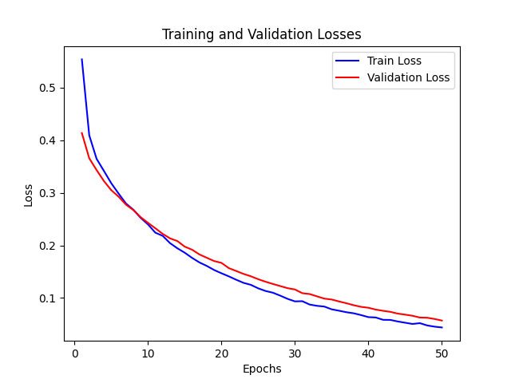

# Applications of Deep Learning in Urban Perception

This repository contains the internship report on the applications of Deep Learning in urban perception, carried out at the Laboratoire of Applied Geomatics and GIS Science (LAGGIS) at the University of Ottawa.

## Objectives

The objective of this internship was to explore the possibilities offered by Deep Learning techniques to analyze urban perception data and thus contribute to a better understanding of urban planning in Ottawa. By combining the knowledge acquired at ENSG and what I was able to learn during my stay at the University of Ottawa, I was able to conduct in-depth research in this emerging field, using data from surveys conducted by LAGGIS.

The main idea was to compare influence of the data from Google Streetview a proprietary solution and Mapillary a crowd-founded solution on the models and on the resulting heatmaps. The heatmaps are created using ArcGIS and using an inverse distance interpollation to take a look at the results of the ranking models data surrounding Ottawa.

This repository contains the models that were trained on the "connection to nature" attribute here is an example of a heatmap produced using that data : 

  
  <figcaption style="text-align: center; font-style: italic; font-size: 14px;">Heatmap generated with the classification model trained on Mapillary data using the VGG19 architecture.</figcaption>

    

## Content

This repository presents the different stages of the research, from data preparation to Deep Learning model training, including survey exploration and comparison of results obtained. This repository also highlights the professional skills developed during this internship, as well as the contributions of the internship supervisor and the organization.

The two main models being trained are a comparison model and a ranking model. This repository contains various iterations of both the models using backbones such as VGG19 or the Google ViT. Results are usually the loss and accuracy curve and for the finetuned models also have a text folder containing the parameters for the model.

Here are some examples of curves you can find : 

  <figure style="text-align: center; flex: 1;">
    
    <figcaption style="font-style: italic; font-size: 14px;">VGG19 Streetview Accuracy curve</figcaption>
  </figure>
  <figure style="text-align: center; flex: 1;">
    
    <figcaption style="font-style: italic; font-size: 14px;">VGG19 Streetview Loss curve</figcaption>
  </figure>

You can also find some code for the interaction between the Mapillary API here is a diagram of the processs : 

<figure style="text-align: center;">
  
  <figcaption style="text-align: center; font-style: italic; font-size: 14px;">Diagram of the API request process to Mapillary.</figcaption>
</figure>

## Author

This internship was carried out by Hannick Abdul Kuthoos, a student at the École Nationale des Sciences Géographiques (ENSG) and an intern at the Laboratoire of Applied Geomatics and GIS Science (LAGGIS) at the University of Ottawa.

